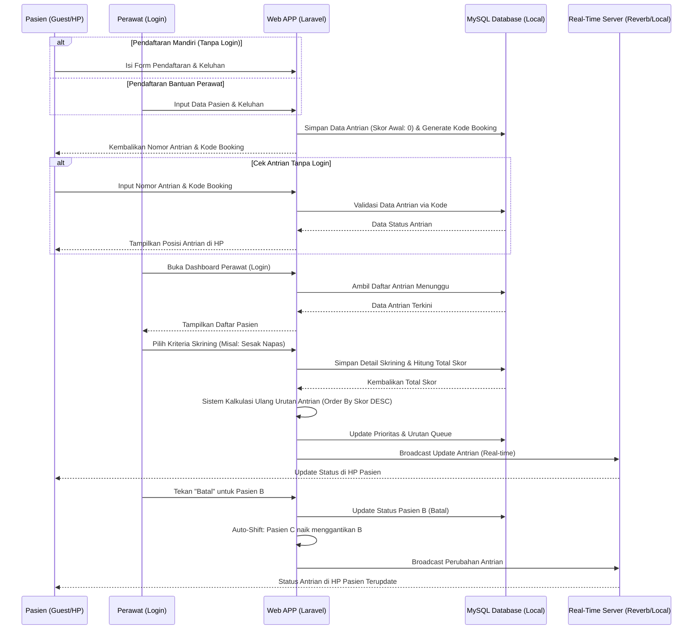
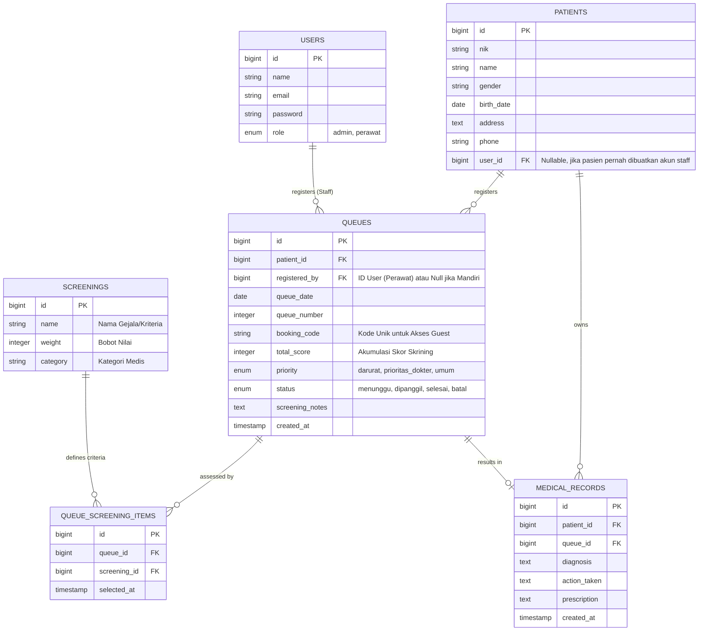
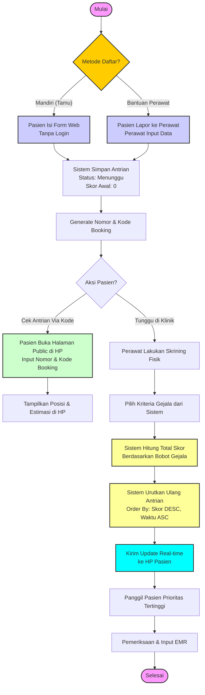

# PRD — Project Requirements Document

## 1. Overview
Fasilitas pelayanan kesehatan sering kali menghadapi kendala dalam mengelola antrian pasien, terutama saat ada pasien dengan kondisi darurat, pasien yang tiba-tiba membatalkan janji, atau pasien yang tidak memiliki akses teknologi untuk mendaftar sendiri. Jika menggunakan sistem manual, hal ini menyebabkan penumpukan, kebingungan, dan ketidakpuasan pasien.

Aplikasi ini adalah **Sistem Rekam Medik Elektronik (EMR) berbasis web yang dilengkapi dengan Sistem Antrian Cerdas**. Aplikasi ini bertujuan untuk mendigitalkan pencatatan riwayat medis pasien sekaligus mengatur lalu lintas antrian secara otomatis menggunakan metode *First-In, First-Out* (FIFO) yang dimodifikasi dengan **Sistem Skor Medis**. 

Perubahan utama pada versi ini adalah **Pendekatan Tanpa Login (Guest-First) untuk Pasien**. Pasien tidak wajib membuat akun untuk mendaftar atau memantau antrian. Sistem akan menerbitkan **Kode Booking Unik** saat pendaftaran yang digunakan sebagai kunci akses untuk memantau status antrian secara real-time **melalui perangkat pribadi (HP/Laptop)**. Hal ini memastikan inklusivitas akses bagi semua pasien tanpa hambatan registrasi akun. Sistem tetap menyediakan **dua metode pendaftaran** (Mandiri tanpa login dan Bantuan melalui Perawat). Staff (Admin & Perawat) tetap menggunakan autentikasi untuk keamanan data medis.

Infrastruktur aplikasi dirancang untuk **Deployment Lokal (On-Premise)** di dalam jaringan internal klinik. Hal ini dipilih untuk memastikan kecepatan akses maksimal di intranet klinik serta keamanan data rekam medis yang tidak keluar dari server lokal klinik.

## 2. Requirements
- **Berbasis Web:** Aplikasi harus dapat diakses melalui browser baik dari perangkat komputer meja (desktop) maupun ponsel pintar (mobile-responsive) yang terhubung ke jaringan lokal klinik.
- **Manajemen Hak Akses (Role):** Sistem membedakan tampilan dan fungsi untuk 2 jenis pengguna terautentikasi: Admin dan Perawat. **Pasien tidak memerlukan akun/login.**
- **Metode Pendaftaran Ganda (Tanpa Login):** 
  - **Guest-Registration (Mandiri):** Pasien dapat mendaftar sendiri melalui portal web tanpa membuat akun, cukup isi data diri & keluhan.
  - **Nurse-Assisted Registration:** Perawat dapat mendaftarkan pasien yang datang langsung ke klinik tanpa akses web ke dalam sistem antrian.
- **Akses Berbasis Kode Booking:** 
  - Pasien mengakses dashboard status antrian pribadi hanya dengan memasukkan **Nomor Antrian** dan **Kode Booking** (atau Nomor HP) yang diterima saat pendaftaran.
  - Tidak ada sesi login persisten untuk pasien.
- **Logika Antrian Dinamis Berbasis Skor:** 
  - Harus mengakomodasi penilaian kriteria medis (skrining) yang memiliki bobot nilai.
  - Prioritas antrian ditentukan oleh akumulasi skor skrining (Skor Tinggi = Prioritas Darurat/Urutan Teratas).
  - Harus memiliki fitur "Batal" yang otomatis memajukan nomor urut pasien di belakangnya.
- **Infrastruktur:** Aplikasi dibangun dalam satu kesatuan sistem (Monolith) menggunakan Laravel dan disebarkan (deploy) pada **Server Lokal** (Localhost/Intranet) dengan dukungan fitur *real-time* mandiri.

## 3. Core Features
- **Sistem Autentikasi Staff:** Portal login yang aman khusus untuk Admin (pengaturan klinik) dan Perawat (skrining, manajemen rekam medis, & pendaftaran bantuan).
- **Pendaftaran Pasien Tanpa Akun (Guest Flow):** 
  - **Portal Pendaftaran Publik:** Formulir web terbuka untuk pasien mengisi data diri (Nama, No HP), keluhan awal, tanpa wajib login.
  - **Dashboard Perawat:** Fitur input cepat bagi perawat untuk mendaftarkan pasien yang datang langsung (walk-in) ke dalam sistem antrian.
- **Formulir Skrining Online:** 
  - Perawat memiliki akses ke daftar kriteria skrining medis (misal: sesak napas, pendarahan) untuk dinilai saat pasien tiba.
- **Manajemen Antrian Pintar (Smart Queue):**
  - **Kalkulasi Skor Prioritas:** Sistem menghitung total skor berdasarkan kriteria skrining yang dipilih perawat. Pasien dengan skor tertinggi otomatis diprioritaskan.
  - **Kategorisasi Otomatis:** Berdasarkan ambang batas skor, sistem dapat memberi label prioritas (Darurat, Prioritas Dokter, atau Umum).
  - **Auto-Shift (Geser Otomatis):** Jika Perawat atau Pasien membatalkan antrian, status antrian berubah menjadi "Dibatalkan", dan antrian di bawahnya otomatis naik/digeser.
- **Fitur Akses Publik (Tanpa Login):**
  - **Cek Antrian Via Kode:** Halaman pencarian publik dimana pasien dapat memasukkan Nomor Antrian dan Kode Booking untuk melihat posisi dan status antrian mereka **pada perangkat pribadi mereka** tanpa perlu login akun.
  - **Notifikasi Real-Time:** Status antrian pada perangkat pasien akan update secara otomatis tanpa perlu refresh halaman saat ada perubahan urutan.
- **Manajemen Rekam Medik (EMR):** Fitur khusus Staff (Perawat/Admin) dalam mencatat hasil pemeriksaan fisik, diagnosis, dan rekam jejak pengobatan pasien.
- **Notifikasi/Status Antrian:** Pasien dapat melihat estimasi waktu atau sisa antrian di depan mereka melalui halaman cek status berbasis kode booking di HP masing-masing.

## 4. User Flow
1. **Pasien (Opsi Mandiri Tanpa Login):** Buka Web -> Isi Formulir Pendaftaran (Nama, HP, Keluhan) -> Sistem Generate Nomor Antrian & Kode Booking -> Pasien Mencatat/Menyimpan Kode -> Memantau status antrian melalui halaman cek status di HP dengan kode tersebut.
2. **Pasien (Opsi Bantuan Perawat):** Pasien datang ke klinik -> Melapor ke meja perawat -> Perawat (Login) menginput data pasien ke sistem -> Sistem Generate Nomor Antrian & Kode Booking -> Pasien menunggu panggilan sambil memantau HP.
3. **Pasien (Opsi Cek Status):** Pasien membuka halaman "Cek Antrian" di HP -> Memasukkan Nomor Antrian & Kode Booking -> Sistem menampilkan posisi antrian & estimasi waktu (Tanpa Login).
4. **Perawat:** Login -> Melihat daftar pasien masuk (dari web atau input manual) -> Melakukan asesmen fisik -> **Memilih kriteria skrining dari sistem** (misal: memilih "Sesak Napas" dan "Nyeri Dada") -> Sistem menghitung total skor -> Antrian sistem otomatis menyesuaikan urutan berdasarkan skor tertinggi.
5. **Proses Antrian:** Perawat memanggil pasien sesuai urutan aplikasi (berdasarkan skor & waktu) -> Jika pasien tidak hadir/batal, Perawat menekan tombol "Batal" -> Antrian pasien berikutnya otomatis maju 1 langkah -> **Status di HP Pasien Terupdate Otomatis**.
6. **Pemeriksaan & EMR:** Pasien diperiksa -> Perawat memasukkan data Rekam Medis ke sistem -> Status antrian pasien menjadi "Selesai".

## 5. Architecture
Aplikasi ini menggunakan arsitektur *Monolith* tradisional berbentuk Model-View-Controller (MVC) bawaan Laravel. Browser bertindak sebagai klien yang merender halaman dari server. Komunikasi *real-time* untuk update status di HP pasien menggunakan teknologi WebSocket yang di-hosting secara lokal (Self-hosted).



## 6. Database Schema
Sistem ini membutuhkan beberapa tabel utama untuk mengatur pengguna staff, data medis, logika antrian, dan kriteria penilaian skrining. Tabel users hanya untuk staff.

**Daftar Tabel Utama:**
- **users**: Menyimpan data login dan role khusus Staff (Admin, Perawat).
- **patients**: Menyimpan data identitas biologis pasien secara detail (tidak wajib terhubung ke users).
- **screenings**: Tabel master yang berisi kriteria penilaian medis (nama gejala) dan bobot nilainya.
- **queues**: Tabel krusial untuk mencatat status antrian, total skor skrining, prioritas, tanggal kunjungan, dan **kode akses publik (booking_code)**.
- **queue_screening_items**: Tabel pivot untuk mencatat kriteria skrining spesifik yang dipilih pada setiap antrian.
- **medical_records**: Menyimpan riwayat pemeriksaan lengkap, terhubung ke pasien dan antrian.



## 7. Tech Stack
Berikut adalah teknologi yang direkomendasikan dan disepakati untuk membangun sistem ini:

- **Frontend:** **Laravel Blade** (Bawaan Laravel untuk merender HTML secara server-side). Dapat dipadukan dengan Tailwind CSS atau Bootstrap untuk membuat tampilan antarmuka (UI) yang responsif dan modern sesuai tampilan_mobile.
- **Backend:** **Laravel** (Framework PHP yang sangat tangguh dalam menangani logika kompleks seperti kalkulasi skor antrian, auto-shifting, dan manajemen MVC).
- **Database:** **MySQL** (Relational database yang stabil dan sangat cocok dengan ekosistem Laravel Eloquent ORM untuk relasi antar tabel skrining dan antrian). **Database berjalan di server lokal yang sama dengan aplikasi.**
- **Real-Time Engine:** **Laravel Reverb** (Disarankan untuk deployment Lokal). Menggunakan WebSocket server yang di-hosting sendiri (self-hosted) untuk memberikan update otomatis pada **status antrian di HP pasien** tanpa bergantung pada layanan pihak ketiga (SaaS), memastikan data tetap di dalam jaringan klinik.
- **Deployment:** **Local Server (On-Premise)**. Aplikasi dijalankan di lingkungan server lokal klinik (misal: menggunakan **XAMPP**, **Laragon**, atau **Docker** di jaringan internal). 
  - **Keuntungan:** Kecepatan akses tinggi dalam intranet, keamanan data rekam medis terjaga karena tidak keluar dari jaringan klinik, dan tidak bergantung pada koneksi internet eksternal untuk operasional harian.
  - **Persyaratan:** Server fisik atau virtual lokal harus memiliki spesifikasi memadai untuk menjalankan PHP, MySQL, dan WebSocket Server secara bersamaan.

## 8. Use Case Diagram
Diagram ini menggambarkan interaksi antara aktor (Admin, Perawat) dengan sistem serta akses Tamu (Pasien Tanpa Login) berdasarkan fitur utama yang telah didefinisikan.

```mermaid
usecaseDiagram
    actor "Admin" as Admin
    actor "Perawat" as Nurse
    actor "Pasien (Tamu/No Login)" as Guest

    package "Sistem Antrian & EMR" {
        usecase "Login Staff" as UC1
        usecase "Kelola Data Master Skrining" as UC2
        usecase "Kelola Data Pengguna Staff" as UC3
        usecase "Daftar Antrian Mandiri (Tanpa Login)" as UC4
        usecase "Cek Status Antrian via Kode (HP)" as UC5
        usecase "Lihat Daftar Antrian Masuk" as UC7
        usecase "Input Skrining & Hitung Skor" as UC8
        usecase "Panggil Pasien & Kelola Antrian" as UC9
        usecase "Input Rekam Medis (EMR)" as UC10
        usecase "Daftar Antrian Bantuan Perawat" as UC11
        usecase "Batalkan Antrian" as UC12
    }

    Admin --> UC1
    Admin --> UC2
    Admin --> UC3
    
    Guest --> UC4
    Guest --> UC5

    Nurse --> UC1
    Nurse --> UC7
    Nurse --> UC8
    Nurse --> UC9
    Nurse --> UC10
    Nurse --> UC11
    Nurse --> UC12

    UC8 ..> UC9 : Mempengaruhi Prioritas
    UC12 ..> UC9 : Memicu Auto-Shift
```

## 9. Process Flowchart
Diagram alur ini menjelaskan proses bisnis utama dari pendaftaran pasien (baik mandiri tanpa login maupun bantuan perawat) hingga penyesuaian antrian berdasarkan skor skrining medis.

